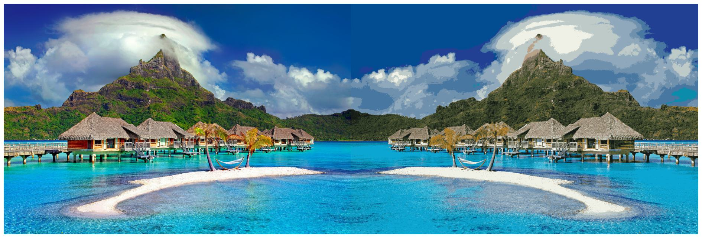

# Intro
This project uses the kmeans algorithm to clusterize colors in the images and generate a simplified colored version of the input image.

Given a number of clusters (N), the kmeans algorithm will define clusters regions where the colors are equivalent. Those clusters or groups will be represented by the cluster center of each group, which is the point with minimum distance to all the points in the group. So, if we replace the original colors for the center of each respective group, we will get an image with only N different colors.

# Examples
For each example, we have this elements in common:
+ The original image is on the left.
+ A total of 16 cluster centers were used.

## Example 1: Airplane view

In this case, this is my background image on LinkedIn ([link](https://www.linkedin.com/in/ricardo-fern%C3%A1ndez-jim%C3%A9nez-b01297130/)).

## Example 2: Cloudy day

For this image, all the colors in the generated image (right) are gray tones. Furthermore, all the colors on the houses on the left have disappeared on the right, due to the colorless tones in the original image.

## Example 3: Vivid color template

In this case we have more unique and differentiable colors, but the differences between the original image and the processed one are minimal. If you look closely, there are some colors which disappeared, like the yellow tones in the mountain or the orange tones from the houses.

**Note:** this image was gathered from [pexels.com](https://www.pexels.com/es-es/), and the author is [Julius Silver](https://www.pexels.com/es-es/@julius-silver-240301/).

# TODOs
+ Define a function which will transfer the principal colors from an image to another.
+ Add a filter to smooth the transition between images.

# References
+ Kmeans over images in Sklearn: https://scikit-learn.org/stable/auto_examples/cluster/plot_color_quantization.html
+ Example 3 image: https://www.pexels.com/es-es/foto/cabanas-en-medio-de-la-playa-753626/
